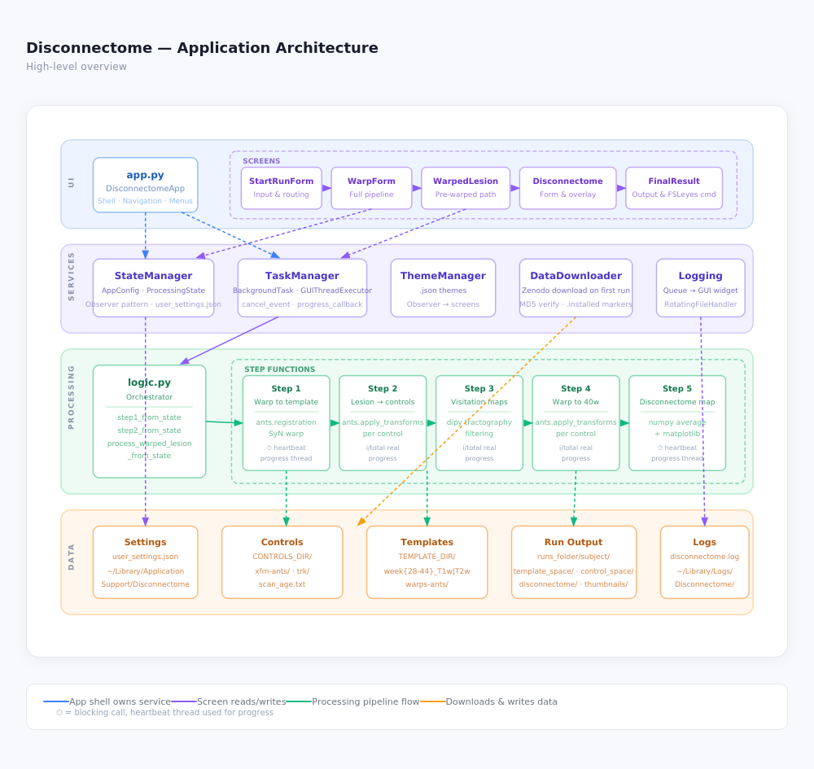

# Disconnectome

[](https://opensource.org/licenses/MIT)
[](https://www.python.org/downloads/)
[](https://github.com/sufkes/neonatal_disconnectome)

A desktop application for analyzing brain disconnectivity patterns in neonatal brain imaging data.

## Table of Contents

- [Overview](#overview)
- [Processing Pipeline](#processing-pipeline)
- [Prerequisites](#prerequisites)
- [Quick Start](#quick-start)
- [Detailed Build Instructions](#detailed-build-instructions)
  - [macOS](#building-for-macos)
  - [Windows](#building-for-windows)
  - [Linux](#building-for-linux)
- [Command-Line Interface](#command-line-interface)
  - [Interactive Mode](#interactive-mode)
  - [Scripted / Batch Mode](#scripted--batch-mode)
  - [Flag Reference](#flag-reference)
- [Running with Docker](#running-with-docker)
  - [Quick Start](#docker-quick-start)
  - [Providing Data](#providing-data)
  - [Environment Variables](#environment-variables)
  - [Example Compose File](#example-compose-file)
- [Data Package Setup](#data-package-setup)
- [Development](#development)
- [Versioning](#versioning)
- [Changelog](#changelog)
- [Troubleshooting](#troubleshooting)
- [Contributing](#contributing)
- [License](#license)

---

## Overview

Disconnectome is a Python-based desktop application built with CustomTkinter that provides a graphical interface for brain lesion disconnectome analysis. The application supports:

- T1w and T2w brain image processing
- Lesion mask warping to age-matched templates
- Disconnectome map generation
- Pre-warped lesion workflow
- Headless / batch processing via a full-featured CLI
- Cross-platform deployment (macOS, Windows, Linux, Docker)

## Processing Pipeline

The application runs a five-step pipeline to produce a disconnectome map from a neonatal brain image and lesion mask.



The **pre-warped** path skips Step 1 entirely — use `--warped` / `-w` on the CLI or select the pre-warped option in the GUI when the lesion mask has already been registered to a dHCP template externally.

---

---

## Prerequisites

### All Platforms

- **Python 3.11 or higher** ([Download](https://www.python.org/downloads/))
- **Git** ([Download](https://git-scm.com/downloads))
- **8 GB RAM minimum** (16 GB recommended)
- **10 GB free disk space** (for build process and data)

### Platform-Specific Tools

#### macOS

```bash
xcode-select --install
/bin/bash -c "$(curl -fsSL https://raw.githubusercontent.com/Homebrew/install/HEAD/install.sh)"
brew install imagemagick   # optional, for icon conversion
```

#### Windows

- **Visual C++ Redistributable** ([Download](https://aka.ms/vs/17/release/vc_redist.x64.exe))
- **Inno Setup** — optional, for creating installers ([Download](https://jrsoftware.org/isinfo.php))

#### Linux (Ubuntu/Debian)

```bash
sudo apt-get update
sudo apt-get install -y python3.11 python3.11-venv python3-pip \
    python3-tk gcc build-essential pkg-config libhdf5-dev cmake
```

#### Linux (Fedora/RHEL)

```bash
sudo dnf install -y python3.11 python3-tkinter gcc gcc-c++ make hdf5-devel cmake
```

---

## Quick Start

```bash
# 1. Clone the repository
git clone https://github.com/sufkes/neonatal_disconnectome.git
cd neonatal_disconnectome

# 2. Create a virtual environment
python3 -m venv venv
source venv/bin/activate   # Windows: venv\Scripts\activate

# 3. Install dependencies
pip install --upgrade pip
pip install -r requirements.txt

# 4. Run the GUI
python app.py

# 5. Or run the CLI
python cli.py --help
```

---

## Detailed Build Instructions

### Building for macOS

```bash
source venv/bin/activate
pip install pyinstaller
chmod +x build_macos.sh
./build_macos.sh both      # clean + build
./build_macos.sh dmg       # create distributable DMG
```

Output: `Disconnectome-macOS.dmg`

### Building for Windows

```bat
venv\Scripts\activate
pip install pyinstaller
build_windows.bat both
build_windows.bat installer   # optional: create Inno Setup installer
```

Output: `dist\Disconnectome\Disconnectome.exe`

### Building for Linux

```bash
source venv/bin/activate
pip install pyinstaller
chmod +x build_linux.sh
./build_linux.sh both        # clean + build
./build_linux.sh appimage    # create AppImage
./build_linux.sh deb         # create .deb package
```

Output: `Disconnectome-x86_64.AppImage` and/or `disconnectome_1.0.0_amd64.deb`

---

## Command-Line Interface

The CLI (`cli.py` / `disconnectome-cli`) allows fully headless processing — useful for batch jobs, HPC clusters, and Docker-based workflows.

### Interactive Mode

Add `-i` / `--interactive` to any command to be prompted for any inputs you haven't supplied as flags. Flags always take precedence; only missing values are prompted. Path prompts support **Tab autocomplete** on macOS and Linux (requires `pyreadline3` on Windows).

```bash
# Fully interactive — prompts for everything
python cli.py start -i

# Partially pre-filled — only prompts for what's missing
python cli.py start -i -s sub01 -g 36

# Interactive disconnectome generation
python cli.py generate_disconnectome -i
```

### Scripted / Batch Mode

Omit `-i` and supply all flags explicitly. Missing required flags produce a single clear error listing everything that's absent.

```bash
# Full pipeline (raw brain image → disconnectome)
python cli.py start \
  -r /data/runs \
  -s sub01 \
  -g 36 \
  -t T2w \
  -b /data/sub01_brain.nii.gz \
  -l /data/sub01_lesion.nii.gz

# Warped-lesion pipeline (skip registration, lesion already in template space)
python cli.py start \
  -r /data/runs \
  -s sub01 \
  -g 36 \
  -t T2w \
  -w \
  -l /data/sub01_lesion_warped.nii.gz

# Generate disconnectome only (step 1 already completed)
python cli.py generate_disconnectome \
  -r /data/runs \
  -s sub01 \
  -g 36 \
  -t T2w \
  -l /data/sub01_lesion.nii.gz

# Check / download data files
python cli.py check_data
python cli.py check_data -a          # auto-download without prompting
python cli.py check_data -d /mnt/data  # use a custom data directory
```

### Flag Reference

All flags apply to both `start` and `generate_disconnectome` unless noted.

| Short       | Long                        | Description                                                      |
| ----------- | --------------------------- | ---------------------------------------------------------------- |
| `-i`        | `--interactive`             | Prompt for any missing inputs                                    |
| `-r`        | `--runsfolder`              | Path to the runs output folder                                   |
| `-s`        | `--subjectid`               | Subject identifier                                               |
| `-g`        | `--gestational-age`         | Gestational age in weeks (28–44)                                 |
| `-t`        | `--brain-image-type`        | `T1w` or `T2w`                                                   |
| `-l`        | `--lesion-mask`             | Path to lesion mask file                                         |
| `-b`        | `--subject-brain-image`     | Path to brain image (`start --not-warped` only)                  |
| `-w` / `-W` | `--warped` / `--not-warped` | Whether lesion is already in template space (`start` only)       |
| `-d`        | `--data-dir`                | Override data directory (also: `DISCONNECTOME_DATA_DIR` env var) |
| `-a`        | `--auto-download`           | Download missing data without prompting                          |

#### Specifying a custom data directory

Pass `-d` / `--data-dir` to any command, or export the environment variable once in your shell to avoid repeating it:

```bash
# Per-command flag
python cli.py start -d /mnt/shared/data -r ./runs ...

# Environment variable (persists for the session)
export DISCONNECTOME_DATA_DIR=/mnt/shared/data
python cli.py start -r ./runs ...
```

This is especially useful in dev mode where the default system data location may not have the data yet.

---

## Running with Docker

The CLI is the recommended interface when running inside Docker. The GUI requires a display server and is not covered here.

### Docker Quick Start

```bash
# Build the image
docker build -t disconnectome .

# Run interactively
docker run --rm -it \
  -v /path/to/data:/data \
  -v /path/to/runs:/runs \
  disconnectome \
  python cli.py start -i -d /data
```

### Providing Data

The application needs `controls/` and `template/` directories. In Docker these are typically bind-mounted rather than downloaded at runtime. The application detects mounted data automatically — no marker files are required.

```bash
# Mount pre-extracted data directly
docker run --rm \
  -v /path/to/data:/app/data \
  -v /path/to/runs:/runs \
  disconnectome \
  python cli.py start \
    -d /app/data \
    -r /runs \
    -s sub01 -g 36 -t T2w \
    -b /runs/sub01_brain.nii.gz \
    -l /runs/sub01_lesion.nii.gz
```

If the data directory is read-only (e.g. an immutable layer or NFS mount), the application will still recognise the data — it just won't be able to write marker files, which is fine.

### Environment Variables

| Variable                 | Description                                                                               |
| ------------------------ | ----------------------------------------------------------------------------------------- |
| `DISCONNECTOME_DATA_DIR` | Path to the directory containing `controls/` and `template/`. Equivalent to `--data-dir`. |

```bash
docker run --rm \
  -e DISCONNECTOME_DATA_DIR=/app/data \
  -v /path/to/data:/app/data \
  -v /path/to/runs:/runs \
  disconnectome \
  python cli.py start -r /runs -s sub01 -g 36 -t T2w \
    -b /runs/brain.nii.gz -l /runs/lesion.nii.gz
```

### Example Compose File

```yaml
# docker-compose.yml
services:
  disconnectome:
    build: .
    environment:
      - DISCONNECTOME_DATA_DIR=/app/data
    volumes:
      - ./data:/app/data:ro # read-only data mount
      - ./runs:/runs # read-write output mount
    command: >
      python cli.py start
        -r /runs
        -s sub01
        -g 36
        -t T2w
        -b /runs/sub01_brain.nii.gz
        -l /runs/sub01_lesion.nii.gz
```

```bash
docker compose run --rm disconnectome
```

### Dockerfile Notes

Make sure `git` is installed in your image if you plan to run `generate_changelog.py` inside the container:

```dockerfile
RUN apt-get update && apt-get install -y git
```

---

## Data Package Setup

The application requires two large data packages that are **not bundled** with the application and must be hosted separately:

| Package    | Contents                                          | Size    |
| ---------- | ------------------------------------------------- | ------- |
| `controls` | Control subject tractography data                 | ~5.6 GB |
| `template` | dHCP brain templates (28–44 weeks) and ANTs warps | ~3 GB   |

### Step 1 — Create the Packages

```bash
# From the project root, assuming data/controls/ and data/template/ exist
tar -czf controls.tar.gz -C data controls/
tar -czf template.tar.gz -C data template/

# Verify
ls -lh controls.tar.gz template.tar.gz
```

### Step 2 — Generate Checksums

```bash
md5sum controls.tar.gz template.tar.gz
# macOS: md5 controls.tar.gz template.tar.gz
```

Copy the resulting MD5 hashes — you will need them in Step 4.

### Step 3 — Upload to a Hosting Service

#### Option A: Zenodo (recommended for research)

1. Go to [zenodo.org](https://zenodo.org) and create an account
2. Click **Upload → New upload**
3. Upload `controls.tar.gz` and `template.tar.gz`
4. Fill in metadata and click **Publish**
5. Note the file URLs (format: `https://zenodo.org/records/{ID}/files/{filename}`)

#### Option B: Institutional server

```bash
scp controls.tar.gz template.tar.gz username@server.university.edu:/public/disconnectome/
# URLs: https://server.university.edu/public/disconnectome/controls.tar.gz
```

#### Option C: AWS S3

```bash
aws s3 cp controls.tar.gz s3://your-bucket/ --acl public-read
aws s3 cp template.tar.gz s3://your-bucket/ --acl public-read
# URLs: https://your-bucket.s3.amazonaws.com/controls.tar.gz
```

### Step 4 — Update `lib/data_downloader.py`

Replace the placeholder values with your actual URLs and MD5 checksums:

```python
DATA_SOURCES = {
    "controls": {
        "url": "https://your-host.example.com/controls.tar.gz",  # from Step 3
        "md5": "abc123...",                                        # from Step 2
        "size_mb": 5600,
        "required": True,
        "description": "Control subject tractography data",
    },
    "template": {
        "url": "https://your-host.example.com/template.tar.gz",  # from Step 3
        "md5": "def456...",                                        # from Step 2
        "size_mb": 3000,
        "required": True,
        "description": "dHCP brain templates (28-44 weeks) and warps",
    },
}
```

### Automatic Download (end users)

Once the URLs are configured, end users are prompted to download on first launch. The download can also be triggered manually:

```bash
python cli.py check_data          # prompt to download if missing
python cli.py check_data -a       # download automatically without prompting
python cli.py check_data -d /path # download to a custom directory
```

### Manual Installation (end users)

If automatic download is unavailable (e.g. in an air-gapped environment), download the archives manually and extract them into the data directory:

```bash
DATA_DIR="${HOME}/.local/share/Disconnectome/data"            # Linux
# DATA_DIR="${HOME}/Library/Application Support/Disconnectome/data"  # macOS
# DATA_DIR="%APPDATA%\Disconnectome\data"                         # Windows
mkdir -p "$DATA_DIR"

curl -L https://zenodo.org/records/17981084/files/controls.tar.gz | tar -xz -C "$DATA_DIR"
curl -L https://zenodo.org/records/17981084/files/template.tar.gz | tar -xz -C "$DATA_DIR"
```

Expected directory layout after extraction:

```
$DATA_DIR/
├── controls/
│   └── <control subject folders>
└── template/
    ├── templates/
    └── warps-ants/
```

---

## Development

### Running in Development Mode

```bash
source venv/bin/activate
python app.py       # GUI
python cli.py --help  # CLI
```

In development mode the application checks for a `data/` directory in the project root first. If `data/controls/` exists it will be used automatically — no need to install data to the system location.

You can also point at any directory using the env var or flag:

```bash
DISCONNECTOME_DATA_DIR=/path/to/data python app.py
python cli.py start -d /path/to/data ...
```

### Project Structure

```
disconnectome/
├── app.py                      # GUI entry point
├── cli.py                      # CLI entry point
├── generate_changelog.py       # Changelog generator
├── bump_version.py             # Version bump utility
├── backend/
│   ├── logic.py                # Processing orchestration
│   ├── step1*.py               # Warp to age-matched template
│   ├── step2*.py               # Apply lesion to control warps
│   ├── step3*.py               # Generate visitation maps
│   ├── step4*.py               # Warp to 40w template
│   └── step5*.py               # Generate disconnectome map
├── lib/
│   ├── constants.py            # Paths, version info
│   ├── state_management.py     # Shared state dataclasses
│   ├── data_downloader.py      # Data download/verification
│   └── utils.py                # Shared utilities
├── .github/
│   └── workflows/
│       ├── build.yml           # CI build on tag push
│       ├── changelog.yml       # Auto-generate changelog on tag push
│       └── version_sync.yml    # Sync version in constants.py on tag push
└── CHANGELOG.md                # Auto-generated, do not edit by hand
```

---

## Versioning

Version numbers follow [Semantic Versioning](https://semver.org) (`MAJOR.MINOR.PATCH`). The version in `lib/constants.py` is managed automatically — you should not edit it by hand.

### Bumping the Version

Use `bump_version.py` from the project root:

```bash
python bump_version.py patch    # 1.0.0 → 1.0.1  (bug fixes)
python bump_version.py minor    # 1.0.1 → 1.1.0  (new features)
python bump_version.py major    # 1.1.0 → 2.0.0  (breaking changes)
python bump_version.py 2.1.0    # set an exact version

python bump_version.py patch --dry-run   # preview without changes
python bump_version.py patch --no-tag    # commit but skip tagging
```

This script:

1. Updates `__version__` and `__build_date__` in `lib/constants.py`
2. Commits the change with a `chore: bump version to X.Y.Z` message
3. Creates an annotated git tag `vX.Y.Z`

After running, push the tag to trigger the CI build and release pipeline:

```bash
git push origin --follow-tags
```

> **Note:** If you create a tag manually (e.g. via the GitHub UI), the `version_sync` GitHub Actions workflow will automatically patch `lib/constants.py` and commit it back to the default branch.

### Commit Message Convention

This project uses [Conventional Commits](https://www.conventionalcommits.org/). The changelog generator reads these prefixes to categorise changes:

| Prefix                                                    | Changelog section |
| --------------------------------------------------------- | ----------------- |
| `feat:`                                                   | Added             |
| `fix:`, `perf:`, `revert:`                                | Fixed             |
| `refactor:`, `chore:`, `docs:`, `style:`, `ci:`, `build:` | Changed           |
| `BREAKING CHANGE` in footer, or `!` after prefix          | Breaking Changes  |

Each commit should have a single type. If a change spans multiple categories, split it into separate commits:

```bash
git add cli.py
git commit -m "feat: add interactive mode to CLI"

git add lib/data_downloader.py
git commit -m "fix: check_installation accepts manually mounted data directories"
```

---

## Changelog

`CHANGELOG.md` is generated automatically from git history. Do not edit it by hand.

### Generate Locally

```bash
# Requires git to be installed
python generate_changelog.py             # writes CHANGELOG.md
python generate_changelog.py --stdout    # preview without writing
python generate_changelog.py -o OUT.md  # custom output path
```

### Automatic Generation

The `changelog` GitHub Actions workflow regenerates `CHANGELOG.md` and updates the GitHub Release body every time a version tag is pushed. No manual steps needed.

---

## Troubleshooting

### Data not found / prompted to download unexpectedly

If you have data installed but the app keeps asking to download:

1. Verify the data directory contains `controls/` and `template/` subdirectories.
2. Check the directory being used: run `python cli.py check_data` — it prints the path being searched.
3. If running in Docker or with manually extracted data, the marker files may be absent. This is handled automatically — the app scans the directory contents instead.
4. Override the directory explicitly: `python cli.py check_data -d /your/data/path`.

### Application crashes on launch

```bash
# Run from terminal to see full output
python app.py

# Or check the log file
cat disconnectome.log
```

### Data download fails

1. Verify URLs in `lib/data_downloader.py` are accessible.
2. Check MD5 checksums match actual files.
3. Try downloading manually and extracting into the data directory (see [Manual Installation](#manual-installation)).

### Build is too large

Exclude unnecessary packages in `Disconnectome.spec`:

```python
excludes = ['matplotlib.tests', 'scipy.tests', 'pytest', 'IPython', 'jupyter']
```

### Platform-Specific Issues

**macOS — "App is damaged and can't be opened"**

```bash
xattr -cr dist/Disconnectome.app
```

**Windows — "Windows protected your PC"**
Click "More info" → "Run anyway", or code-sign the executable.

**Linux — "error while loading shared libraries"**

```bash
sudo apt-get install libxcb-xinerama0   # Ubuntu/Debian
sudo dnf install xcb-util-wm            # Fedora
```

**Docker — `git: not found` when running generate_changelog.py**

```dockerfile
RUN apt-get update && apt-get install -y git
```

---

## Continuous Integration

The repository includes three GitHub Actions workflows triggered on `v*.*.*` tag pushes:

| Workflow     | File               | What it does                                                          |
| ------------ | ------------------ | --------------------------------------------------------------------- |
| Build        | `build.yml`        | Builds and packages for macOS, Windows, Linux; creates GitHub Release |
| Changelog    | `changelog.yml`    | Regenerates `CHANGELOG.md`; populates Release body                    |
| Version Sync | `version_sync.yml` | Patches `lib/constants.py` if tagged without using `bump_version.py`  |

To trigger all three:

```bash
python bump_version.py minor
git push origin --follow-tags
```

---

## Pre-Release Checklist

- [ ] Run `python bump_version.py <part>` to bump the version
- [ ] Upload updated data packages to Zenodo if data has changed
- [ ] Update URLs/checksums in `lib/data_downloader.py` if data packages changed
- [ ] Test full pipeline on at least two platforms
- [ ] Push with `git push origin --follow-tags`
- [ ] Verify GitHub Release was created with correct artifacts and changelog

---

## Contributing

Contributions are welcome! Please:

1. Fork the repository
2. Create a feature branch: `git checkout -b feat/my-feature`
3. Make focused, single-purpose commits using [Conventional Commits](#commit-message-convention)
4. Push and open a Pull Request

### Development Guidelines

- Follow PEP 8
- Add type hints to new functions
- Update documentation for user-facing changes
- Test on at least two platforms before submitting a PR

---

## License

This project is licensed under the GNU General Public License v3.0 — see the [LICENSE](LICENSE.txt) file for details.

---

## Acknowledgments

- [CustomTkinter](https://github.com/TomSchimansky/CustomTkinter) — Modern UI framework
- [ANTs](http://stnava.github.io/ANTs/) — Image registration toolkit
- [dHCP](https://www.developingconnectome.org/) — Brain templates

---

## Citation

If you use this software in your research, please cite:

```bibtex
@software{disconnectome2024,
  author = {Steven Ufkes},
  title  = {Disconnectome: Brain Disconnectome Analysis Tool},
  year   = {2024},
  url    = {https://github.com/sufkes/neonatal_disconnectome}
}
```

---

## Support

- **Issues:** [GitHub Issues](https://github.com/sufkes/neonatal_disconnectome/issues)
- **Documentation:** [GitHub Wiki](https://github.com/sufkes/neonatal_disconnectome/wiki)
